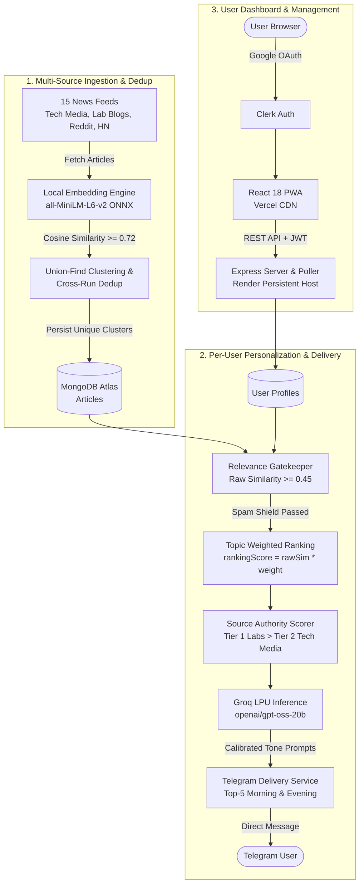

# AI News Delivery Pipeline

Automated, personalized AI-news curation pipeline delivering deduplicated, relevance-filtered, and honesty-calibrated digests twice daily via Telegram.

[](https://nodejs.org/)
[](https://react.dev/)
[](https://www.mongodb.com/atlas)
[](https://core.telegram.org/bots)
[](https://opensource.org/licenses/ISC)

---

## Live Application

- **Web Dashboard**: [https://ai-news-desk-ecru.vercel.app](https://ai-news-desk-ecru.vercel.app)

> [!NOTE]
> This application is a personal curation tool designed for private delivery. While the dashboard supports Clerk authentication and interest profile configuration, receiving digests requires linking a Telegram chat ID with the bot. The raw backend API URL is kept internal to protect free-tier compute resources from untrusted traffic and because all operational endpoints require authenticated Clerk JWTs or internal scheduling keys.

---

## What It Does

The AI News Delivery Pipeline continuously aggregates articles across 15 technical journalism outlets, primary research lab blogs, and community forums. Articles are embedded locally into dense vectors to cluster duplicate coverage across syndicates and deduplicate stories against a rolling 24-hour history.

The pipeline evaluates unique story clusters against individual user interest profiles, filtering out PR and financial spam before scoring relevance. A fast Groq LPU inference engine summarizes representative articles with calibrated honesty, ensuring borderline matches are never oversold. Personalized digests are formatted and dispatched directly to users on Telegram twice daily (a 24-hour top-5 morning digest and an incremental evening update), configured via a responsive Progressive Web App dashboard.

---

## Key Features

- **Semantic Deduplication**: Generates 384-dimensional dense embeddings in-process using `all-MiniLM-L6-v2`. Groups syndicated coverage into cohesive story clusters via Union-Find clustering with an empirically calibrated `0.72` cosine threshold, merging cross-run duplicates across rolling 24-hour windows.
- **Honest, Confidence-Tiered Summaries**: Uses Groq (`openai/gpt-oss-20b`) with adaptive prompt constraints. Low-confidence matches explicitly inform the reader of their peripheral nature rather than hallucinating topical connections to user focus areas.
- **Decoupled Relevance Scoring**: Employs an unweighted raw similarity admission gate (`bestRawSimilarity >= 0.45`) separated from priority weight multipliers (`rankingScore = rawSim * weight`), preventing low-weight niche topics from being mathematically locked out.
- **Keyword Spam & PR Shield**: Multi-pattern regex filter blocking stock pump speculation, SEO market CAGR projections, boilerplate certificates, and affiliate listicles (scale-verified across 753 real-world primary articles with 0 false positives).
- **Twice-Daily Incremental Dispatch**: Dispatches a full top-5 digest at 08:00 IST and an incremental digest at 18:00 IST covering only stories newly ingested since the morning run.
- **Multi-User Isolation**: Independent user profiles with Clerk Google OAuth authentication, isolated `ArticleRelevance` records, and private Telegram delivery targets.
- **Installable PWA Dashboard**: Fast React 18 frontend with Paper/Ink editorial typography, visual loading spinners, inline action retries, automatic 401 session expiration handling, global offline detection, and custom 404 routing.

---

## Architecture



---

## Tech Stack

| Technology | Purpose |
| :--- | :--- |
| **Node.js & Express** | Asynchronous backend API and scheduled pipeline runtime. |
| **MongoDB Atlas** | Document storage for articles, user profiles, relevance scores, and run logs. |
| **`@huggingface/transformers`** | In-process ONNX embeddings (`all-MiniLM-L6-v2`) with zero external API costs. |
| **Groq API (`openai/gpt-oss-20b`)** | Sub-second LPU inference producing factual summaries and reasoning. |
| **Telegram Bot API** | Direct push delivery with Markdown formatting and zero messaging infrastructure costs. |
| **Clerk** | Drop-in Google OAuth authentication and session management. |
| **React 18 + Vite** | Lightweight Progressive Web App with custom offline and error resilience states. |
| **Render** | Persistent Linux container hosting Express and Telegram long-polling worker. |
| **Vercel** | Edge CDN hosting the static React single-page frontend. |
| **Sentry** | End-to-end crash reporting and missed-run watchdog monitoring. |
| **PostHog** | Client-side product analytics tracking pageviews and user actions. |
| **cron-job.org** | External health pinger preventing free-tier compute sleep. |

---

## Interesting Engineering Decisions

- **Decoupling Gatekeeping from Ranking Weights**: An early implementation calculated relevance as `score = rawSimilarity * weight` and checked `score >= threshold`. This mathematically prevented lower-weighted topics (e.g. weight 0.3) from ever passing admission regardless of match quality. The architecture was corrected by decoupling admission (`bestRawSimilarity >= 0.45`) from prioritization (`rankingScore = rawSim * weight`), ensuring low-weight topics remain deliverable when high-priority topics are quiet.
- **Empirical Dedup Threshold Tuning (0.75 → 0.72)**: During validation against 4,465 article pairs, an initial 0.75 cosine similarity threshold missed a syndicated pair covering an identical "Jalapeño AI chip" story (similarity 0.7427). Retuning to 0.72 successfully unified the cluster while maintaining a 3.4% safety margin above the nearest false-positive pair (0.6860), which was subsequently validated against organic multi-source news merges.
- **Honesty Calibration for Borderline Articles**: Standard LLM prompting tends to hallucinate relevance to justify an article's presence. By introducing confidence tiers (`high`, `moderate`, `low`), low-confidence articles are constrained via strict negative system instructions to explicitly describe articles as peripheral overviews rather than fabricating links to the user's primary focus area.
- **Process Persistence vs. Serverless Webhooks**: A split-hosting strategy was chosen using Render for backend and Vercel for frontend. While serverless functions were initially considered for the API, Telegram long-polling and in-process cron scheduling required persistent execution. Hosting a unified background runner (`startAll.js`) on Render eliminated webhook exposure and SSL certificate maintenance on free-tier infrastructure.

---

## Getting Started

### Prerequisites

- Node.js 18+
- MongoDB database instance (Atlas URI or local)
- Telegram Bot token (from `@BotFather`)
- Groq Cloud API key
- Clerk application keys (Google OAuth enabled)

### 1. Clone and Install Dependencies

```bash
git clone https://github.com/Rithwik007/AI_NEWS_DESK.git
cd AI_NEWS_DESK

# Install backend dependencies
npm install

# Install frontend dependencies
cd frontend
npm install
cd ..
```

### 2. Environment Configuration

Create a `.env` file in the project root:

```env
MONGODB_URI=mongodb+srv://<username>:<password>@<cluster>.mongodb.net/ai-news?retryWrites=true&w=majority
GROQ_API_KEY=gsk_...
TELEGRAM_BOT_TOKEN=123456789:ABCdef...
CLERK_PUBLISHABLE_KEY=pk_test_...
CLERK_SECRET_KEY=sk_test_...
SENTRY_DSN=https://...
PORT=3000
```

Create a `frontend/.env` file:

```env
VITE_API_BASE_URL=http://localhost:3000
VITE_CLERK_PUBLISHABLE_KEY=pk_test_...
VITE_SENTRY_DSN=https://...
VITE_POSTHOG_KEY=phc_...
VITE_POSTHOG_HOST=https://us.i.posthog.com
```

### 3. Run Locally

```bash
# Terminal 1: Start backend server and Telegram polling worker
npm run start:all

# Terminal 2: Start frontend Vite dev server
cd frontend
npm run dev
```

To run a manual one-off pipeline execution:

```bash
node src/index.js
```

---

## Project Status

Actively running in daily production for verified users. Built with an emphasis on empirical validation:
- Cosine clustering threshold verified across 4,465 article pairs.
- Keyword spam shield audited across 753 live articles with zero false positives.
- Full-stack observability instrumented with Sentry missed-run watchdogs and PostHog telemetry.

---

## License

This project is licensed under the [ISC License](LICENSE).
